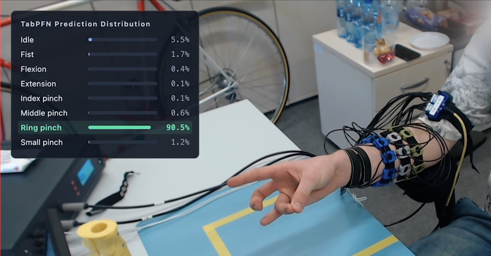

# Cross-user sEMG gesture recognition with TabPFN



<h3 align="center"><a href="https://youtu.be/hDcy_AZDRv8">▶️ Watch the Video Summary</a></h3>

This project compares **TabPFN-3.5-Plus** with two classical pipelines from the
putEMG authors [1], **SVM** and **LDA**, for surface-EMG (sEMG) gesture
recognition. putEMG contains 44
participants performing eight gestures (idle, fist, flexion, extension, and four
finger pinches) while 24 EMG channels are recorded. All models are fit on **40
participants** (215,009 windows) and tested on **four held-out participants**
(20,725 windows), with no target-user calibration.

TabPFN receives a ~488 ms window of all 24 channels as input and predicts
probabilities over the eight gestures. It is not fine-tuned; the training windows
are passed to it as in-context examples.

## Results

Metrics are averaged over the four held-out users (08, 24, 34, 39).

| Model | Accuracy | Macro-F1 | Macro recall |
| --- | ---: | ---: | ---: |
| SVM | 77.80% | 0.6219 | 0.6038 |
| LDA | 82.06% | 0.6844 | 0.6952 |
| **TabPFN-3.5-Plus** | **84.69%** | **0.7374** | **0.7308** |

Additional details -> [full comparison](results/comparison.md)

## Demo

To run the demo UI (the UI seen in the Video Summary), run:

```bash
git clone https://github.com/simon-bachhuber/tabpfn-sEMG-human-gesture-detection.git
cd tabpfn-sEMG-human-gesture-detection
uv sync --locked --python 3.14.4 --extra dev
.venv/bin/emgbench snapshot restore
.venv/bin/emgbench compare
.venv/bin/emgbench report
.venv/bin/emgbench demo
```

Open http://127.0.0.1:8765.

Additional details -> [reproduction.md](docs/reproduction.md)

## Methods

The [methods](docs/methods.md) describe the frozen participant split,
authors-compatible signal processing, exact feature definitions and model
settings, metric aggregation, and recorded-video alignment.

## Reproduction

The repository includes a **1.05 GB, SHA-256-verified snapshot** of the feature
tables, fitted classical models, predictions, prepared traces, and eight 576p
videos. Restore it to reproduce the results and run the demo without preprocessing,
refitting, or a TabPFN API key.

Follow the [reproduction guide](docs/reproduction.md) for installation, snapshot
restoration, verification, the demo, and complete regeneration from raw data.
The [fresh-clone verification](docs/verification.md) records the checks performed
before publishing this snapshot.

## Credits

- [1] Kaczmarek, P.; Mańkowski, T.; Tomczyński, J. *putEMG—A Surface
  Electromyography Hand Gesture Recognition Dataset.* Sensors 2019, 19(16), 3548.
  [doi:10.3390/s19163548](https://doi.org/10.3390/s19163548). See also the
  [dataset page](https://biolab.put.poznan.pl/putemg-dataset/) and
  [reference implementation](https://github.com/biolab-put/putemg_examples).
- **Prior Labs and the TabPFN contributors**:
  [TabPFN](https://docs.priorlabs.ai/) and its hosted inference service.

Project code: **Apache-2.0**. putEMG data, videos, and derived dataset assets:
**CC BY-NC 4.0**. Upstream code retains its notices; see [LICENCE.md](LICENCE.md).
